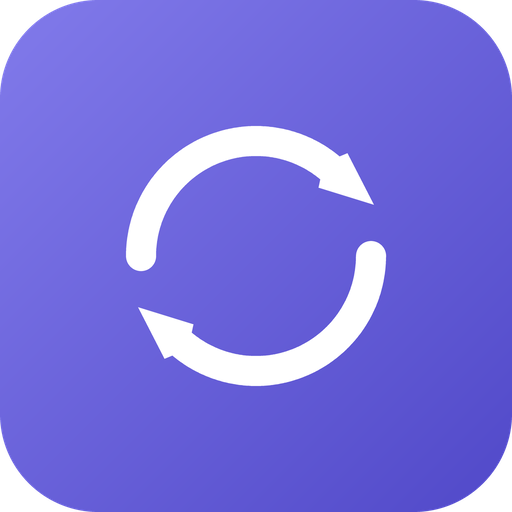

<div align="center">
  

  # Switch NextUp

  **One-click switching between Claude Code and ChatGPT/Codex accounts, with official usage % at a glance.**

  Windows tray + window app · built with [Tauri 2](https://v2.tauri.app/) (Rust) and a static HTML/JS frontend
</div>

---

Switch NextUp keeps several Claude Code and ChatGPT/Codex accounts on file and lets you flip between them
without touching a terminal. Each account card shows the same usage percentages
Claude Code reports via `/usage` — not a local estimate — so you always know how
much runway is left before switching.

## Features

- **One-click switch** between saved accounts — takes effect immediately, with no
  need to restart Claude Code or reload your editor.
- **Both providers, side by side** — a Claude tab and a ChatGPT tab, each with its
  own active account. Switching one never disturbs the other, so you can be signed
  into one Claude account and one ChatGPT account at the same time.
- **Official usage %**, per account — for Claude the same numbers `/usage` reports
  (5-hour / 7-day / 7-day-Sonnet / 7-day-Opus, or the credit balance on
  Enterprise-style plans), and for ChatGPT its own rate-limit windows, spend limit
  or credit balance. The active account's numbers refresh live; idle accounts show
  their last-known numbers instantly, with no extra network calls.
- **In-app login** — authorize a new account or refresh an expired session in your
  browser, right from the app, for **either** provider. No `claude /login`, no
  `codex login`, and no manual re-save step. (Claude asks you to paste the code back
  — its OAuth client refuses an automatic redirect; ChatGPT returns on its own.)
- **System tray** — quick-switch menu grouped by provider, an optional "Start with
  Windows" launch (starts hidden in the tray), and a window that reopens exactly
  where you left it.
- **Compact bar mode** — collapse the window down to a slim strip showing one row
  per active account and its usage meters.
- **Frameless widget UI** — pin-on-top, a switchable window backdrop (Mica,
  Acrylic, or a plain solid look), and an in-app themed dialog instead of native
  popups.

## How it works

Both CLIs keep the signed-in account in plain files on disk, so switching account is
really just swapping those files:

```
Claude Code   ~/.claude/.credentials.json  ->  { "claudeAiOauth": { accessToken, refreshToken, expiresAt, ... } }
              ~/.claude.json               ->  { "oauthAccount": { accountUuid, emailAddress, ... }, ... }

Codex         ~/.codex/auth.json           ->  { "tokens": { access_token, refresh_token, id_token, account_id }, ... }
```

Switch NextUp keeps a named copy of each account under
`~/.switch-nextup/accounts/<provider>/<name>.json`.

- **Switching a Claude account** overwrites `~/.claude/.credentials.json` with the
  chosen account's tokens **and** swaps its identity into `~/.claude.json` →
  `oauthAccount` — Claude Code keys the active account off both files, so both have
  to change together.
- **Switching a ChatGPT account** rewrites `~/.codex/auth.json` only: the identity
  travels inside the token there, so there is no second file to keep in sync. The
  Codex CLI and the Codex desktop app share that folder, so one swap covers both.
- Either way, the account you are switching *away from* gets its current live tokens
  folded back into its saved copy first — both CLIs rotate their tokens, so skipping
  that would reinstall a dead token the next time you switch back.
- **Usage** comes from the same private endpoints the tools themselves use —
  `GET https://api.anthropic.com/api/oauth/usage` for Claude and
  `GET https://chatgpt.com/backend-api/wham/usage` for ChatGPT — authenticated with
  that account's own OAuth token.

> [!IMPORTANT]
> Claude switching only works while Claude Code reads credentials from the file
> above. If Anthropic enables the `tengu_windows_credman` flag for your account,
> Claude Code reads Windows Credential Manager instead and file-swapping stops
> taking effect. Switch NextUp detects this and shows a warning banner rather than
> silently failing. (This does not affect ChatGPT/Codex accounts.)

## Install

There's no published build yet — install by building it yourself (see
[Develop](#develop) below). `npm run build` produces a per-user NSIS installer at
`src-tauri/target/release/bundle/nsis/`.

> [!NOTE]
> The installer is currently unsigned, so Windows SmartScreen will warn about an
> "unknown publisher" on first run — that's expected. It installs per-user, with no
> UAC prompt required.

## First run

Pick the **Claude** or **ChatGPT** tab first — each provider has its own account list
and its own active account, and the steps below work the same on either.

1. Log into an account in Claude Code (or Codex) as usual, then in Switch NextUp
   click **+ Save current account** and give it a name (e.g. `work`).
2. Add another account either by logging in through the CLI again and saving, or by
   clicking **+ Add account** to authorize a new one in your browser without leaving
   the app.
   - On the **ChatGPT** tab the browser returns on its own — there is nothing to do.
   - On the **Claude** tab, approve the request and then **paste the code back into
     the app**. That extra step is not an oversight: Anthropic's OAuth client refuses
     an automatic redirect, and the official CLI falls back to pasting in exactly the
     same way.
3. Click **Switch** on any card — or use the tray's quick-switch menu — to make it
   active. A Claude account and a ChatGPT account can be active at the same time.

The app lives in the system tray once you close its window: left-click the tray
icon to reopen it, right-click for the quick-switch menu. Closing with **✕** hides
to the tray rather than quitting.

## Window controls

| Control | Action |
| --- | --- |
| 📌 | Pin the window always-on-top |
| ◐ | Cycle the window backdrop style |
| ⟳ | Refresh the active account's usage |
| ⬍ | Collapse to a compact usage bar |
| ✕ | Hide to the tray (does not quit) |

The **Clear data…** footer button wipes Switch NextUp's own saved accounts and
usage cache (or does a full reset) — it never touches `~/.claude/` or `~/.codex/`,
so it cannot sign you out of Claude Code or Codex.

## Develop

Requires the Rust toolchain and Node.js.

```sh
npm install
npm run dev      # hot-reload dev window
npm run build    # release installer -> src-tauri/target/release/bundle/nsis/
```

Rust-only check: `cd src-tauri && cargo build`. Tests: `cargo test`.

> [!NOTE]
> `src/` is embedded into the binary at build time — only `npm run dev` serves it
> live. Launching an already-built executable after editing the frontend shows the
> **old** UI until you rebuild.

## Documentation

- **[docs/architecture.md](docs/architecture.md)** — how the app is put together: the
  switching mechanism and its safety rules, per-provider differences, the storage
  layout, the Tauri command surface, and the gotchas worth knowing before changing
  anything.
- **[docs/usage-api.md](docs/usage-api.md)** — the reverse-engineered auth and usage
  APIs for both providers: endpoints, headers, response shapes, token refresh, and
  the OAuth login flows, with notes on how to re-derive them if they change.

## Notes & limitations

> [!WARNING]
> `~/.switch-nextup/` stores each account's OAuth tokens in **plaintext**, exactly
> as Claude Code and Codex themselves do under `~/.claude/` and `~/.codex/`. Treat
> that folder as sensitive.

- Both usage endpoints are private, undocumented APIs the tools use internally — if
  Anthropic or OpenAI changes one, Switch NextUp degrades to showing "Usage
  unavailable" for that provider rather than failing outright.
- **Windows only, for now.** macOS would need Keychain-based credential storage
  instead of a plaintext file, plus a different window backdrop implementation —
  a real port, not just another build target.

## License

[MIT](LICENSE).

Switch NextUp is an independent project. It is not affiliated with, endorsed by, or
supported by Anthropic or OpenAI. It reads and writes the credential files their
official CLIs already keep on disk, and reads the same usage endpoints those tools
use, with your own account's credentials.
